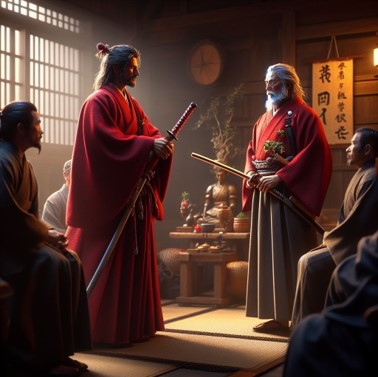
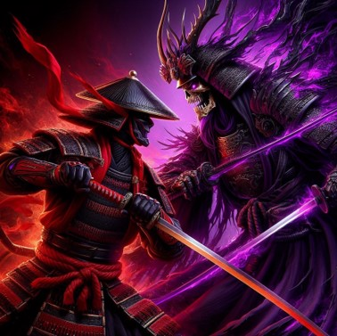
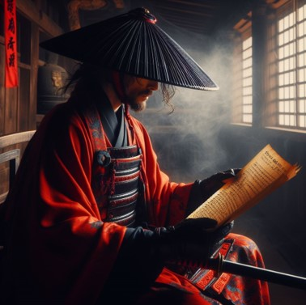
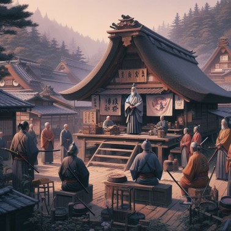
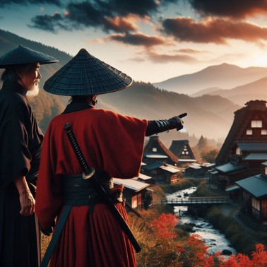
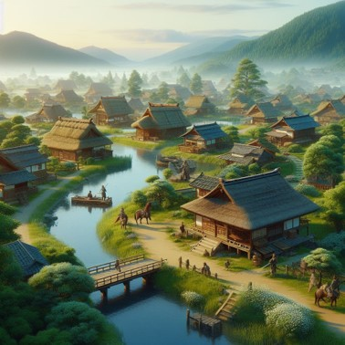

# Blade-of-Honor

<table>
  <tr>
    <td align="center"><a href="https://github.com/matheus-1618"> <b>Adney Costa</b></a> </td>
    
   <td align="center"><a href="https://github.com/DomRuanSuzano"> <b>Dom Ruan</b></a> </td>

  <td align="center"><a href="https://github.com/HudsonArauj"> <b>Hudson Araujo</b></a> </td>

  <td align="center"><a href="https://github.com/josephkneto"> <b>Joseph Kallas</b></a> </td>

  </tr>
</table>

Beginning:
In a land steeped in ancient traditions, you step into the sandals of a young samurai named Hiro. The peaceful village of Akarui has long been under the benevolent protection of the Samurai Council. However, dark forces begin to gather as rumors of a malevolent warlord, Lord Kuroshi, emerge. The village elder, sensing impending danger, calls upon you, Hiro, to undergo the rigorous training of the samurai to protect your home.

Construction:
Through trials and challenges, Hiro embarks on a quest to master the way of the samurai. Along the way, he learns essential skills of swordsmanship, stealth, and wisdom from the revered Sensei. As he progresses, Hiro encounters various obstacles orchestrated by Lord Kuroshi's minions seeking to sow chaos and fear in Akarui. With each victory and lesson learned, Hiro grows stronger and more attuned to the ancient code of Bushido.

End:
As Hiro reaches the pinnacle of his training, the sinister forces of Lord Kuroshi launch a massive assault on Akarui. Leading his fellow samurai, Hiro confronts the malevolent warlord in a fierce battle. Through skillful swordplay and unwavering resolve, Hiro defeats Lord Kuroshi, restoring peace to the village. The people of Akarui celebrate Hiro as a hero, and the Samurai Council acknowledges his valor and bravery, recognizing him as a true embodiment of the samurai's code – the Blade of Honor. With tranquility restored, Hiro continues his journey, ever vigilant, to protect the land and its people.

- Rectitude (義, Gi): "In the heart of a true samurai lies the principle of rectitude. Upholding righteousness in all actions, one cultivates honor and integrity. Gi guides the blade and the spirit, shaping the noble path of the warrior."

- Courage (勇, Yuu): "Amidst adversity, courage blazes brightly within the soul of a samurai. Fearlessly facing challenges, a warrior stands unwavering, embracing valor and fortitude. With courage, one forges through darkness to find the light."

- Benevolence (仁, Jin): "The essence of a samurai resonates with benevolence. Embracing compassion and empathy, one extends kindness to all. Through acts of mercy and understanding, the warrior's strength lies not only in skill but in a benevolent heart."

### Inspiration images

|  |  |  |
|----------------------------------|----------------------------------|----------------------------------|
|  |  |  |

### Assets links

- https://assetstore.unity.com/packages/2d/environments/pixel-art-platformer-village-props-166114
- https://assetstore.unity.com/packages/2d/characters/martial-hero-170422#publisher
- https://assetstore.unity.com/packages/2d/characters/bringer-of-death-free-195719
- https://assetstore.unity.com/packages/2d/characters/evil-wizard-168007
- https://assetstore.unity.com/packages/2d/characters/bandits-pixel-art-104130

Sounds:

- https://www.jamendo.com/community/ambient/tracks
- https://freesound.org/search/?q=japan&f=&w=&tm=0&s=Automatic+by+relevance&advanced=0&g=1&only_p=&cm=0&page=3#sound
- https://www.zapsplat.com/sound-effect-category/forest-and-jungle-ambiences/
- https://pixabay.com/sound-effects/search/beach/
